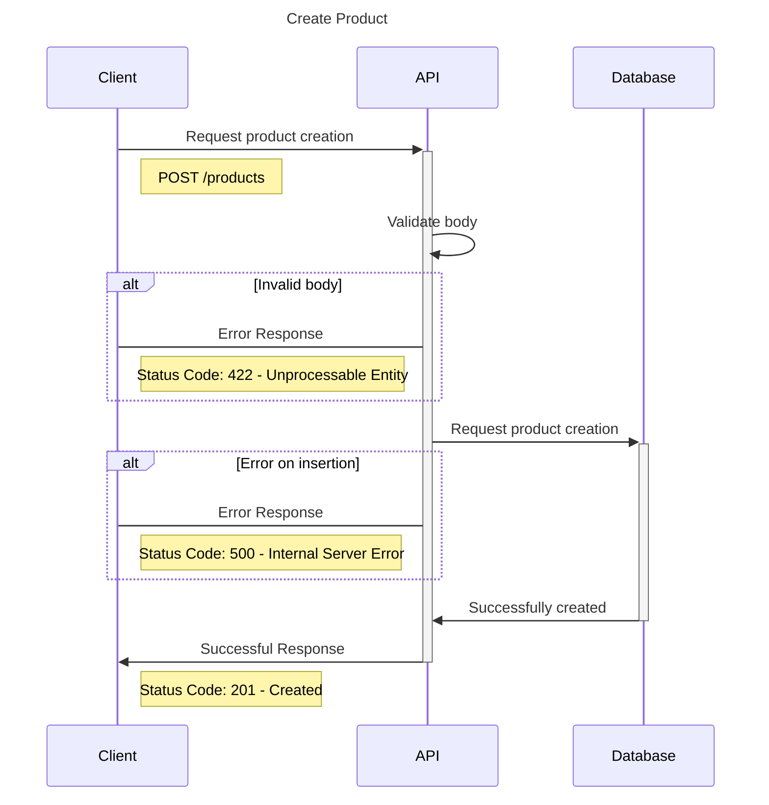
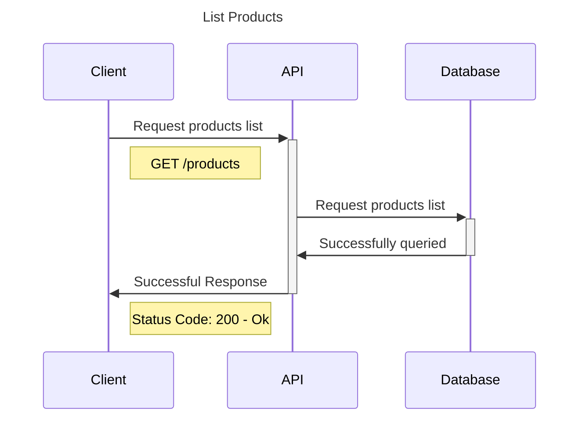
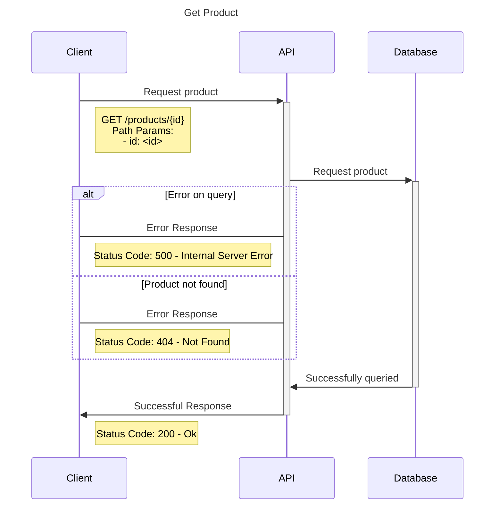
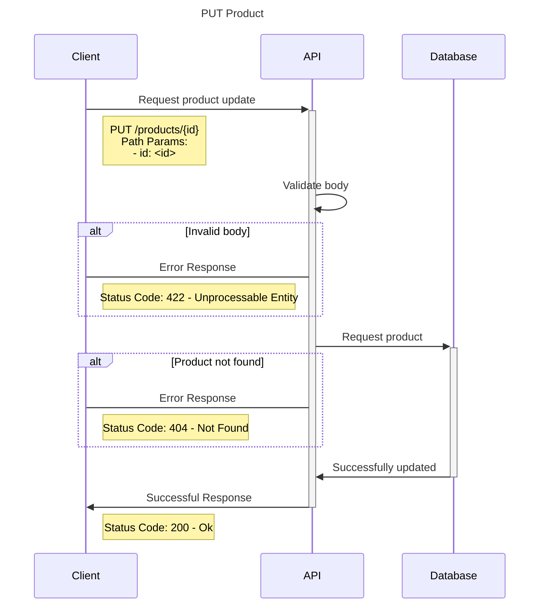
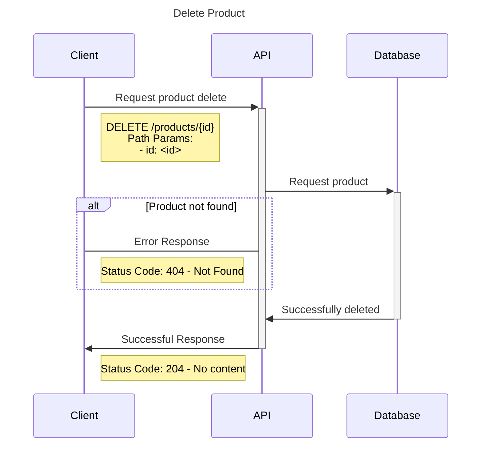

# Bootcamp_Santander

# Erick Santos
## About me
Graduate in Cybersecurity 🎓 | Passionate about Networks and Information Security 💻 | Seeking innovative solutions to protect data and systems 🛡️|

I'm Erick, a graduate in Information Security and passionate about Computer Networks and Cybersecurity. 🧠💻

I've worked as a Level 2 Support Analyst, gaining hands-on experience in managing and securing networks in dynamic environments. I'm familiar with tools like Zabbix, Nagios, Grafana, and The Dude, and have worked with routers, switches, firewalls, and RF equipment.

My focus is on keeping systems connected, secure, and running smoothly — making sure data stays safe, available, and reliable. I'm always looking to learn more and apply my knowledge to solve real-world problems in tech. 🚀🔐

## Conecte-se comigo

## Habilidades

## GitHub Stats

# TDD Project

## O que é TDD?
TDD é uma sigla para `Test Driven Development`, ou Desenvolvimento Orientado a Testes. A ideia do TDD é que você trabalhe em ciclos.

### Ciclo do TDD

### Vantagens do TDD
- entregar software de qualidade;
- testar procurando possíveis falhas;
- criar testes de integração, testes isolados (unitários);
- evitar escrever códigos complexos ou que não sigam os pré-requisitos necessários;

A proposta do TDD é que você codifique antes mesmo do código existir, isso nos garante mais qualidade no nosso projeto. Além de que, provavelmente se você deixar pra fazer os testes no final, pode acabar não fazendo. Com isso, sua aplicação perde qualidade e está muito mais propensa a erros.

# Store API
## Resumo do projeto
Este documento traz informações do desenvolvimento de uma API em FastAPI a partir do TDD.

## Objetivo
Essa aplicação tem como objetivo principal trazer conhecimentos sobre o TDD, na prática, desenvolvendo uma API com o Framework Python, FastAPI. Utilizando o banco de dados MongoDB, para validações o Pydantic, para os testes Pytest e entre outras bibliotecas.

## O que é?
Uma aplicação que:
- tem fins educativos;
- permite o aprendizado prático sobre TDD com FastAPI + Pytest;

## O que não é?
Uma aplicação que:
- se comunica com apps externas;

## Solução Proposta
Desenvolvimento de uma aplicação simples a partir do TDD, que permite entender como criar tests com o `pytest`. Construindo testes de Schemas, Usecases e Controllers (teste de integração).

### Arquitetura
||
|:--:|
| Diagrama de C4 da Store API |

### Banco de dados - MongoDB
||
|:--:|
| Database - Store API |

## StoreAPI
### Diagramas de sequência para o módulo de Produtos
#### Diagrama de criação de produto

#### Diagrama de listagem de produtos

#### Diagrama de detalhamento de um produto

#### Diagrama de atualização de produto

#### Diagrama de exclusão de produto

